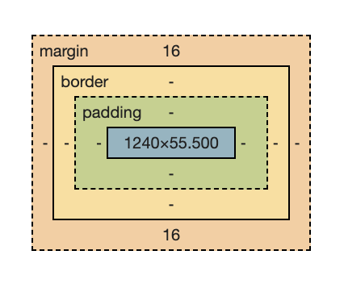
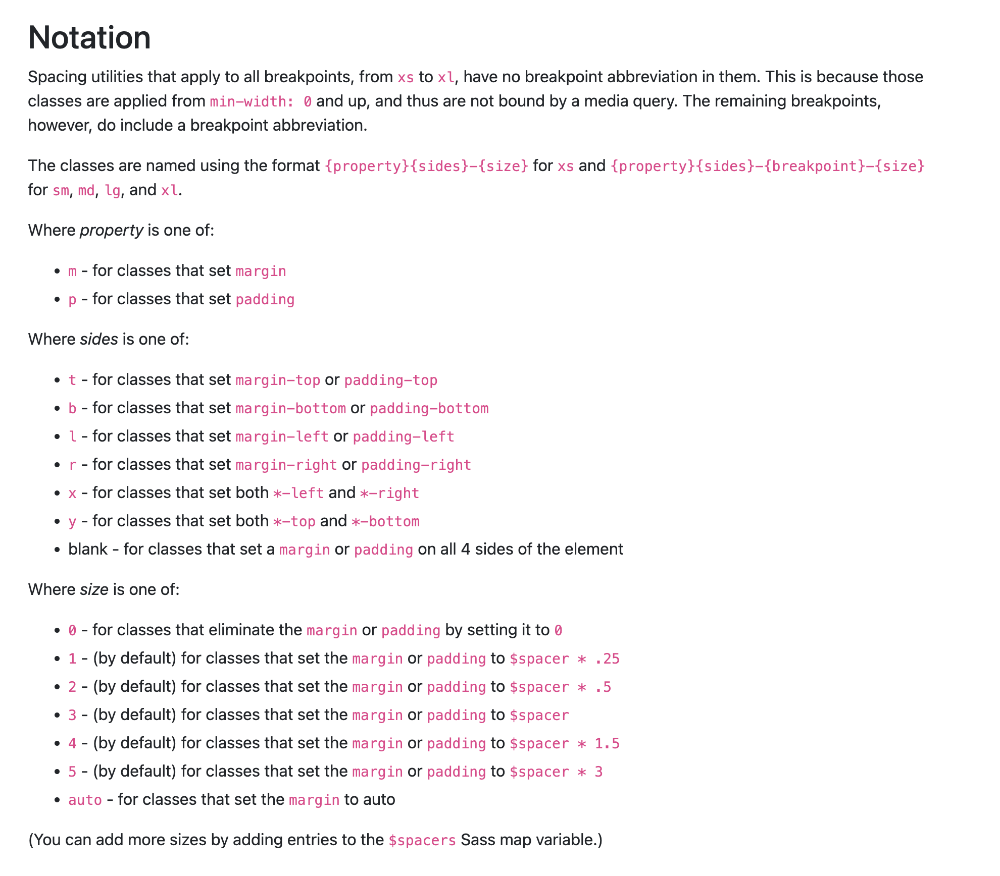

# udemy-complete-web-development-bootcamp

## 1. Front-End Web Development

> 1. How does the internet actually work? \
>    Connected Computers all over the world \
>    ( DNS : Domain Name System Server ) - basically an address/phonebook book

> 2. How does websites works?
>     1. HTML : The Content
>     2. CSS : The Style, Colors appears
>     3. Java Script : The Functionality

> 3. What are Webpages? \
>    A web page is a hypertext document on the World Wide Web. Web pages are delivered by a web server to the user and displayed in a web browser. A website consists of many web pages linked together under a common domain name.

## 2. Introduction to HTML

-   You cannot created website just with CSS and Javascript , HTML is mandatory
-   HTML markup is done uning html tags
-   Headings tag \<h#>
    -   From h1 to h6
    -   Don't have more than one h1
    -   Don't skip level of headings tag
-   Paragraph Element \<p>
-   Html Void Elements
    -   \<hr/> - Horizontale Line
    -   \<br/> - Break
    -   Don't use breaks as a new lines
    -   Write the complete the tag with "/" as well for readbility

## 3. Intermediate HTML

-   Html List Elements
    -   Un-Ordered List \<ul>
    -   Ordered List \<ol>
    -   They both have list elements - \<li>
-   Html Attribute
    -   \<tagname attribute=value> Html Text \</tagname>
-   Html Anchor Element \<a>
    -   needs an attribute \<a href=\"link">Link Text</a>
-   Html Image Element
    -   \
    -   Don't have closing tag
-   Html Div Element
    -   \<div></div> completely invisible
    -   whole puspose is to act as a container for applying CSS

## 4. Multipage Websites

-   File Paths :

    > -   Absolute File Path : Relative to the Root of the Computer System

              Ex - /Users/adi.s.d/Downloads/3.4 Birthday Invite Project

    > -   Relative File Path : Relative to Current dirctory usually

              Ex - intermediate-html/anchor-tag.html

-   Symbols :

    >

           -   "../eassay.docx" - one directory up the current location
           -   "./eassay.docx" - inside the current directory

-   Html Boilerplate

    -   \<!DOCTYPE html> : tells browser about the html version
    -   \<html lang=\"en"> : The main html tag, Language declaration for assistive devices
    -   \<head> tag : Header information of your webpage
        -   \<meta charset=\"UTF-8"> : tells browser about character encoding of the webpage
        -   \<title>Title of your website\</title> : Dispalyed on Chrome tab
    -   \<body> tag : All the conent of the webpage

-   Ex -

          <!DOCTYPE html>
          <html lang="en">
          <head>
              <meta charset="UTF-8">
              <meta name="viewport" content="width=device-width, initial-scale=1.0">
              <title>Document</title>
          </head>
              <body>
              </body>
          </html>

## 5. Introduction to CSS

-   CSS : Cascading Style Sheet
-   SASS : Syntactically awesome stylrsheet
-   LESS : Leaner CSS
-   How to add CSS?

    >

          1.  Inline : Targetting a single HTML element
              Ex - <tag style="css">
          2.  Internal : Targeting a single HTML page
              Ex - <style>CSS</style>
          3.  External : Targetting multipage website, a separate file for CSS
              Ex - <link href="style.css">

-   CSS Syntax -

    >

          <tag-selector> {
              <css-property> : <css-property-value>
          }

-   CSS Slectors

    -   A part that selects the html elements to apply the rules to

    -   Types : > 1. Element Selector -
        <name-of-the-tag> { CSS Code } 2. Class Selector -
        .<name-of-the-class> { CSS Code }
        ( Class name is an atrribute added to html tag for grouping similar styled elements ) 3. Id Selector - #<elemet-id> { CSS Code }
        ( Id is an attribute for a html tag to identify it as unique ) 4. Attribute Selector -
        <tag-name>[<attribute-name>="<attribute-value>"]{CSS Code}
        ( Select a tag with specific attribute or specific attribute value pair ) 5. Universal Selector - \* {CSS Code}
        (Select everything)

## 6. CSS Properties

-   Color Properties

    -   background-color
    -   color (text color)
    -   named colors
    -   hex Codes rgb()
    -   colorhunt.com

-   Font Properties

    -   Font Size :
        -   1px = 1/96th inch = 0.26mm
        -   1pt = 1/72nd inch = 0.35mm
        -   1em = 100% of parent (Relative Size)
        -   1rem = 100% of root (Relative Size)
        -   named sizes = large, xx-large, small, etc.
    -   Font Weight :
        -   normal, bold
        -   lighter, bolder : relative to parent
        -   number : 100 - 900 range
    -   Font Family : \<font-name>, \<back-up-type-face>
        -   sans serif : no feet, right angle edges
        -   serif : letters with feet
        -   Helvetica, sans-serif
        -   "Times New Roman", serif
        -   fonts.google.com
    -   Text Align :
        -   start, end, center, justify

-   CSS Box Model

    -   Element Size
        -   height: \<size-in-pixel or percentage>
        -   weidth: \<size-in-pixel or percentage>
    -   Margin
        -   distance between the end of the border and other elements
    -   Padding
        -   distance between content of the element and its border
    -   Border

        -   border: \<thickness> \<style> \<color>
        -   if the thickness is changed the border will grow outwards
        -   border-width: \<top> \<right> \<bottom> \<left> OR <top+bottom> <left+right>
        -   OR separately like - border-top : \<size>

    -   ( All values work like border )

        

## 7. Intermediate CSS

-   CSS Cascade

    -   if you have multiple CSS rules targetting same HTML element but they have an order of importance so the most important style gets displayed
    -   4 categories to determine overall importance of CSS rule

    1. Position : importance from top to bottom in external and internal css
    2. Specificity : how specific a selector is; element slector < class selector < attribute < id
    3. Type : inline style > internal style > external stylesheet
    4. Importance : ! important keyword - \<css-property> : \<css-value> !important;

    Important keyword > Type > Specificty > Position

-   Combining CSS

    -   Ways to Combine CSS Slector
        -   Group Rule : \<selctor-1> , \<selector-2> { CSS Rule } \
            (Both groups are selected)
        -   Child Rule : \<parent-selctor> \> \<child-selector> { CSS Rule } \
            (Only 1st level of children are selected)
        -   Descendant Rule : \<selctor-1> \<selector-2> { CSS Rule } \
            (Descendant of the left side is selected)
            (Works with 2nd, 3rd level children as well)
        -   Chanining Rule : \<selctor-1>\<selector-2> { CSS Rule } \
            (Apply where all selectors are true)
            (Alwaya start with elemet selectors for chaining)
    -   Combining Combiners : All above can be combined together as well

-   CSS Positioning

    -   Values of CSS Property Position :
        1.  static (default) position - is fixed left, right, top bottom properties doesn't work
        2.  relative position - relative to the default (static) position; left, right, top and bottom properties are enabled
        3.  absolute position - relative to nearest positioned ancestor or top left corener of the webpage if the element doen't have a positnied ancestor; left, right, top and bottom properties are enabled; ancestor should br relative \
            ( Z - index : which element goes on top of which; higher the index, the most on top the element is!)
        4.  fixed positioning - relative to top left of the browser window; if you scroll it will stay in the same page and alway will be visible
    -   Positioning is separate from margin

## 8. Advanced CSS

-   CSS Display Property

    -   \<span></span> tag : it has different value for display (inline)
    -   by default all other elemets have display: block
    -   Values
        1. block:
            - takes up entire full width of the page
            - elements goes on next line by default
        2. inline:
            - take up part of the line so we can fit the next element on the same line until we have space
            - We cannot set width and height of the element
        3. inline-block:
            - same spacing as inline but have the height an width properties
        4. none:
            - hides the element on the page, its there but its not rendered
    -   This is used to set up the layout of the web page

-   CSS Float

    -   This allows us to wrap text around another text
    -   elements with this property are taken out of the html float
    -   Values
        1. left
        2. right
    -   Having float set to an element will make all the other elements wrap around it;to escap the wrapping around we need to set "clear" property of the required element same as float (left, right or both)

-   How to Create a responsive website?

    -   Our website should change and look beautiful on different screen sizes
    -   Ways to do this -
        1. Media Query
            - Something to use as a wrpper for the CSS selector
                ```
                @media (max-width: 600px) {
                    CSS-Code
                }
                ```
            - This actually applies the wrapped CSS when the screen/window width is less than or equal to 600px
        2. CSS Grid
            - Really flexible for creating the web page layout
            - You have a parent div which has diaplay: grid, then we can use grid properties.
            - They have properties for defing the rows and columns, cell sizes and even the gap between then as well
            - It applies to 2D layout; rows and columns
        3. CSS Flexbox
            - You have a parent div which has diaplay: flex, then we can use flexbox properties for elemets inside that container.
            - flex: 1 divide the width in equal parts for each element
            - It is a 1D layout systems wher we can control how to display elements in horizontal or vertical manner
        4. Bootstrap Framework
            - it is external not included into CSS
            - they have predefined CSS classes that can be assigned to our desired html elements
            - Bootstrap is build on top of CSS flexbox - they have 12 box system which divies the row in 12 equal boxes, we can resize the elements to occupy more than one of those boxes
    -   No such things as a best one people uses combinations of these

-   Media Queries
    -   Query Keywords
        1. max-width : less than or equal to
        2. min-width : greater than or equal to
        3. screen / print : used in screen mode or if someone is printing the web page cusing Cntrl + p
    -   The queries can be combined with "and"
    -   Documentation - https://developer.mozilla.org/en-US/docs/Web/CSS/CSS_media_queries/Using_media_queries

## 9. CSS Flexbox

-   Old HTMl will use tables for the page layout (Now it only should be used to representewd actaul table element)
-   more alternative for layouts - tables > display: inline-block and setting width andd height > display: float; setting width and gaps

-   How to use flexbox?

    -   display: flex needs to be applies to the container
    -   after theis we have to use different rules other than display: inline, inline-block or block
    -   when the conainer has the value display flex all the content element will have the display value felx as well and width is adjusted to the inner content of the elements
    -   display: inline-flex allows the main flex coniner to have flexbox property and it to be an inline element with respect to other elements on the web page

-   Flex properties :

    -   gap : (flex-container property)
        -   size of the gap between the conetaining elements
    -   flex-direction : (flex-container property)
        -   default value : row = items get stalked one after the other on the main axis (the x-axis) instead of the cross axis (the y-axis)
        -   column = items will get stacked from top to bottom; this changes the main axis to be the y-axis and cross axis to be the x-axis
        -   the elements always flexes along the main axis
    -   flex-basis : size value - (flex-item property)
        -   if flex-direction: row = it changes the width of the containing elements
        -   if flex-direction: column = it changes the height of the containing elements
    -   we need to differentiate where the flex properties goes - either flex item (children) or the flex container (parent)

-   Creating Flex layout :

    -   order : numbered value - (flex-item property)
        -   used to arrange the flex items in a specific order
        -   "0" is the default value, greater the value it will be added at last of the row/colum
    -   flex-wrap : (flex-container property)
        -   when you run out of the space on horizontal
        -   "nowrap" is the dfault value - it doesn;t let the element go on the next line instead it goes off the page horizontally
        -   "wrap" : it will make the elements go to next line if they don't have enough space on tha page
    -   flex-flow : (flex-container property)
        -   This is a shorthand for the flex-direction and flex-wrap properties, which together define the flex container’s main and cross axes. The default value is row nowrap.
    -   justify-content: (flex-container property)
        -   set distribution of the content items along the main axis
        -   possible values :
            -   flex-start (default) = buched up at the start (left/top direction)
            -   flex-end = bunched up at the end (right/bottom direction)
            -   center, space-between, space-around, space-evenly
    -   align-items: (flex-container property)
        -   set distribution of the content items along the cross axis
        -   possible values : flex-start, flex-end, center, baseline, stertch
        -   it will only work when flex-wrap: nowrap;
    -   align-content: (flex-container property)
        -   set distribution of the content items along the cross axis
        -   possible values : flex-start, flex-end, center, baseline, stertch
        -   it will only work when flex-wrap: wrap;
        -   it works on screens with smaller width to make the page responsive
    -   align-self: (flex-item property)
        -   set distribution of a specific content items along the cross axis
        -   possible values : flex-start, flex-end, center, baseline, stertch

-   Flexbox Sizing:

    -   how to size the items in flexbox container
    -   Flexbox sizing priority lis :
        -   min-width/max-width property > flex-basis > width > content width
    -   Default behaviour :
        -   the items will shrinks to the minimum possible width even if it have to wrap the written content in it afetr it it wwill be pushed off the page not being visible at all.
        -   max-width default : longest possible line from the text
        -   min-width default : longest possible word from the text
    -   max-widtth/min-width : (flex-item property)
        -   max-width : growth potential of the item, while increasing the window size
        -   min-width : shrink potential of the item, while decreasing the window size
    -   flex-grow/flex-shrink: (flex-item property) posssible values - 0/1 (disable/enable)

        -   used to enable or disable growth/shrinkage of the items due to screen resizing beyond the sizing settings from above properties
        -   by default flex-grow = 0, and flex-shrink = 1; this allows items to shrink as per the width priority when screen size is reduced but the items will not grow even if the screen size is more than enough

        | flex-grow | flex-shrink | flex-basis                                                                                                                     |
        | --------- | ----------- | ------------------------------------------------------------------------------------------------------------------------------ |
        | 0         | 0           | initial starting value; items don't change in the size at all                                                                  |
        | 1         | 0           | item will increase until the entire container is filled, while shrinking it will shrink till flex-basis size not after that    |
        | 0         | 1           | initial starting value; while shrinking it will shrink till minimum width of the content beyond flex-basis size not after that |
        | 1         | 1           | Completely ignored                                                                                                             |

    -   shrthand = flex: \<grow> \<shrink> \<basis> OR <one-value-for-all>
    -   flex-basis : auto = it will look at the content and give more width to the one with more content
    -   flex-basis : 0 = all of the items will have same width

-   Flexbox cheet sheet - https://css-tricks.com/snippets/css/a-guide-to-flexbox/

## 10. Display Grid

-   For laying out content in 2D on the web page
-   Creating a grid :
    ```
        .container {
            display: grid;
            grid-template-columns: 1fr 2fr /* 1:2 ratio for two columns*/
            grid-template-rows: 1fr 1fr /* 1:1 ratio for two rows*/
            gap: 10px
        }
    ```
-   Grid Sizing :

    -   Possible values for template-columns/template-rows
        -   100px 200px = fixed size in pixels; not responsive
        -   200px auto = auto will take 100% of teh screen if set in column, and fir the content in columns
        -   1fr 2fr = fractional sizing; responsive
        -   200px minmax(400px, 800px) = it will limit the size increase to min - 400px to max 800px
        -   repeat(3, 200px) = repeat 200px row/column 3 times
    -   combining template-row and template-columns
        -   grid-template: 100px 200px / 400px 800px
        -   grid-template: \<rows> / \<columns>
    -   if we have lesser items than the spaces in our grid, the grid always will strt to fill items from top-left to right then on the next row from left again and remaining spaces will be empty
    -   if we have lesser grid that our items, teh remaining items will use the column sizing from the grid but height will match its content
    -   grid-auto-rows/grid-auto-column: this allows to style the extra items which did not fit the grid

-   Grid Terminology:

    -   grid containner
    -   grid items
    -   tracks
        -   row tracks
        -   column tracks
    -   grid cell
    -   grid lines

-   Grid Placement:
    -   By default the grid items are placed from top-left to top-right then the next row from left to right until the grid is fininshed
    -   You can use flexbox with grid
    -   grid-column/grid-row (gid item property):
        -   grid-column-start/grid-row-start: \<line-number>
        -   grid-column-end/grid-row-end: \<line-number>
        -   OR span \<number-of-cells>
    -   grid-area: \<row-start> / \<column-start> / \<row-end> / \<column-end>
        -   if you use on one itemn you should use it on all the items
    -   grid item order : same as flexbox, greater the value lesser the priority

## 11. Bootstrap CSS

-   Bootsrtap Framework

    -   external CSS developed buy Twitter developers, we can just add classes to our html to stylize the css is already written
    -   advantages :
        -   quick and easy developement
        -   really good browser compatibility
    -   disadvantages :
        -   class bloat, reduces html readability
        -   no customizations (very hard to make changes to the components)
    -   Ways to use it :
        -   CDN (Content delivery network) \<link href=\"link-address" />
        -   Your custom style sheet should ALWAYS go below the CDN reference or your style will be overwritten by the bootstrap css

-   Bootstrap Layout

    -   12 Column layout: the window is devided into 12 equal responsive portions
    -   container > row > column
    -   container itself can have a size - container, container-sm, container-md, container-lg, container-xl, container-xxl, container-fluid (100% on all screen sizes)
    -   column sizing:
        -   col, col-2 to col-12: col-6 will be 50%, as total needs to be 12
        -   similar sizing is available as the container class
        -   col-sm-2 : screen size \>= 576px
        -   if you don't specify size number on the col class they will occupi equal portions in the row
        -   on screens smaller than 576px, mobile devices, all columns with or without sizes will take up the whole space and behaves like just "col"
        -   you can also have multiple breakpoints on single div

-   Bootstrap Components

    -   Button : https://getbootstrap.com/docs/5.0/components/buttons/
    -   Cards : https://getbootstrap.com/docs/5.0/components/card/
    -   NavBar : https://getbootstrap.com/docs/5.0/components/navbar/
    -   Examples : https://getbootstrap.com/docs/5.3/examples/

-   Bootstrap Cpacing Notation

    -   link : https://getbootstrap.com/docs/4.0/utilities/spacing/

    

-   Bootsrap Dark Mode

    -   link : https://getbootstrap.com/docs/5.3/customize/color-modes/

-   Different CSS Frameworks
    -   https://github.com/troxler/awesome-css-frameworks

---

## Tips and Tricks :

-   XXvh sizing : stands for "viewport height"; its percentage of the window height; responsive
-   div : by default div occupies the complete width of the window but the height is calculated only for the content unless specified
-   Xrem size : not responsive;
