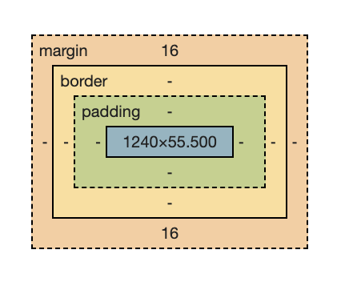

# udemy-complete-web-development-bootcamp

## 1. Front-End Web Development

> 1. How does the internet actually work? \
>    Connected Computers all over the world \
>    ( DNS : Domain Name System Server ) - basically an address/phonebook book

> 2. How does websites works?
>     1. HTML : The Content
>     2. CSS : The Style, Colors appears
>     3. Java Script : The Functionality

> 3. What are Webpages? \
>    A web page is a hypertext document on the World Wide Web. Web pages are delivered by a web server to the user and displayed in a web browser. A website consists of many web pages linked together under a common domain name.

## 2. Introduction to HTML

-   You cannot created website just with CSS and Javascript , HTML is mandatory
-   HTML markup is done uning html tags
-   Headings tag \<h#>
    -   From h1 to h6
    -   Don't have more than one h1
    -   Don't skip level of headings tag
-   Paragraph Element \

-   Html Void Elements
    -   \
 - Horizontale Line
    -   \  - Break
    -   Don't use breaks as a new lines
    -   Write the complete the tag with "/" as well for readbility

## 3. Intermediate HTML

-   Html List Elements
    -   Un-Ordered List \<ul>
    -   Ordered List \<ol>
    -   They both have list elements - \<li>
-   Html Attribute
    -   \<tagname attribute=value> Html Text \</tagname>
-   Html Anchor Element \<a>
    -   needs an attribute \<a href=\"link">Link Text</a>
-   Html Image Element
    -   \
    -   Don't have closing tag
-   Html Div Element
    -   \

 completely invisible
    -   whole puspose is to act as a container for applying CSS

## 4. Multipage Websites

-   File Paths :

    > -   Absolute File Path : Relative to the Root of the Computer System

            Ex - /Users/adi.s.d/Downloads/3.4 Birthday Invite Project

    > -   Relative File Path : Relative to Current dirctory usually

            Ex - intermediate-html/anchor-tag.html

-   Symbols :

    >

         -   "../eassay.docx" - one directory up the current location
         -   "./eassay.docx" - inside the current directory

-   Html Boilerplate

    -   \<!DOCTYPE html> : tells browser about the html version
    -   \<html lang=\"en"> : The main html tag, Language declaration for assistive devices
    -   \<head> tag : Header information of your webpage
        -   \<meta charset=\"UTF-8"> : tells browser about character encoding of the webpage
        -   \<title>Title of your website\</title> : Dispalyed on Chrome tab
    -   \<body> tag : All the conent of the webpage

-   Ex -

        <!DOCTYPE html>
        <html lang="en">
        <head>
            <meta charset="UTF-8">
            <meta name="viewport" content="width=device-width, initial-scale=1.0">
            <title>Document</title>
        </head>
            <body>
            </body>
        </html>

## 5. Introduction to CSS

-   CSS : Cascading Style Sheet
-   SASS : Syntactically awesome stylrsheet
-   LESS : Leaner CSS
-   How to add CSS?

    >

        1.  Inline : Targetting a single HTML element
            Ex - <tag style="css">
        2.  Internal : Targeting a single HTML page
            Ex - 
        3.  External : Targetting multipage website, a separate file for CSS
            Ex - <link href="style.css">

-   CSS Syntax -

    >

        <tag-selector> {
            <css-property> : <css-property-value>
        }

-   CSS Slectors

    -   A part that selects the html elements to apply the rules to

    -   Types :
        >
             1. Element Selector -
                 <name-of-the-tag> { CSS Code }
             2. Class Selector -
                 .<name-of-the-class> { CSS Code }
                 ( Class name is an atrribute added to html tag for grouping similar styled elements )
             3. Id Selector -
                 #<elemet-id> { CSS Code }
                 ( Id is an attribute for a html tag to identify it as unique )
             4. Attribute Selector -
                 <tag-name>[<attribute-name>="<attribute-value>"]{CSS Code}
                 ( Select a tag with specific attribute or specific attribute value pair )
             5. Universal Selector -
                 * {CSS Code}
                 (Select everything)

## 6. CSS Properties

-   Color Properties

    -   background-color
    -   color (text color)
    -   named colors
    -   hex Codes rgb()
    -   colorhunt.com

-   Font Properties

    -   Font Size :
        -   1px = 1/96th inch = 0.26mm
        -   1pt = 1/72nd inch = 0.35mm
        -   1em = 100% of parent (Relative Size)
        -   1rem = 100% of root (Relative Size)
        -   named sizes = large, xx-large, small, etc.
    -   Font Weight :
        -   normal, bold
        -   lighter, bolder : relative to parent
        -   number : 100 - 900 range
    -   Font Family : <font-name>, <back-up-type-face>
        -   sans serif : no feet, right angle edges
        -   serif : letters with feet
        -   Helvetica, sans-serif
        -   "Times New Roman", serif
        -   fonts.google.com
    -   Text Align :
        -   start, end, center, justify

-   CSS Box Model

    -   Element Size
        -   height: \<size-in-pixel or percentage>
        -   weidth: \<size-in-pixel or percentage>
    -   Margin
        -   distance between the end of the border and other elements
    -   Padding
        -   distance between content of the element and its border
    -   Border

        -   border: \<thickness> \<style> \<color>
        -   if the thickness is changed the border will grow outwards
        -   border-width: \<top> \<right> \<bottom> \<left> OR <top+bottom> <left+right>
        -   OR separately like - border-top : \<size>

    -   ( All values work like border )

        
